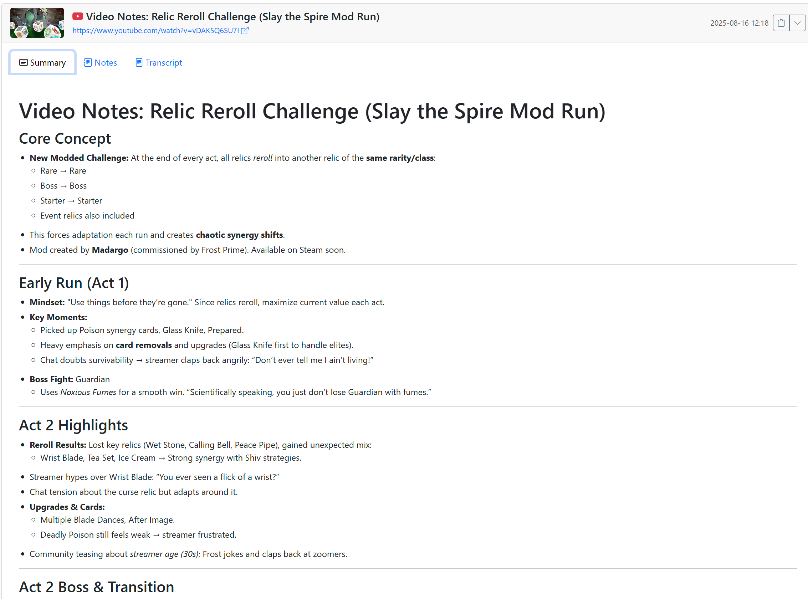

## YouTube Note

A simple web app to fetch YouTube transcripts, summarize them with an LLM, and let you take notes for future reference.

### Features

- Fetch transcripts from YouTube videos
- Generate concise summaries using an LLM
- Write and persist your own notes




### Tech Stack

- Backend: `FastAPI`, `SQLModel` (SQLite), `Jinja2`
- LLM: `langchain` via OpenRouter
- Frontend: Bootstrap 5, HTMX, Marked.js, DOMPurify

### Requirements

- Python 3.12+
- Poetry 1.8+

### Quickstart

1) Install dependencies

  ```bash
  poetry install
  ```

2) Set environment variable

  The app needs an OpenRouter API key to generate summaries.

  ```bash
  cp .env.example .env
  ```

3) Run the app

  ```bash
  poetry run uvicorn youtube_note.server:app --reload
  ```

4) Open in browser: `http://127.0.0.1:8000`

### Configuration

- `openrouter_api_key`: API key used by LangChain to access the OpenRouter provider. The app loads it from the process environment (you may also use a local `.env` if you prefer).
- Database: SQLite file `youtube_notes.db` (created automatically on first run). See `storage.py` for initialization details.

### Project Layout

- `server.py`: FastAPI app, routes, transcript fetching, and LLM summary generation
- `model.py`: SQLModel model `YouTubeNote`
- `storage.py`: DB engine/session setup and lightweight migration
- `templates/`: Jinja2 templates (`index.html`, `_note_card.html`)
- `static/`: Static assets

### API Overview

- `GET /` — Render the index page and list all notes
- `POST /transcript` — Accepts JSON `{ "youtube_url": "..." }` and returns an HTML fragment (server-rendered partial) for the new/updated note card

  Example body:
  
  ```json
  { "youtube_url": "https://www.youtube.com/watch?v=dQw4w9WgXcQ" }
  ```

  URL normalization:
  
  - The server normalizes YouTube URLs to the canonical form `https://www.youtube.com/watch?v=<VIDEO_ID>` before storing and deduplicating notes.
  - Tracking parameters, timestamps, and playlist references are ignored for de-duplication.
  - Examples that resolve to the same video:
    
    ```
    https://www.youtube.com/watch?v=wUrvXN-yiyo&t=3302s
    https://youtu.be/wUrvXN-yiyo?si=abc
    https://www.youtube.com/embed/wUrvXN-yiyo
    ```
    
    All are stored as:
    
    ```
    https://www.youtube.com/watch?v=wUrvXN-yiyo
    ```

Notes:
- The transcript endpoint returns an HTML partial rendered from `_note_card.html` to keep the UI logic on the server.
- If a note for the same URL already exists, it will be updated.

### Testing

Run tests with:

  ```bash
  pytest -q
  ```

Basic test scaffolding exists under `test/`. Tests mock external calls.

### Deployment

- This app uses SQLite by default. For multi-user or production scenarios, consider migrating to a managed database and configure SQLModel accordingly.
- Set the `openrouter_api_key` environment variable in your hosting provider.

### Security and Privacy

- See `SECURITY.md` for reporting vulnerabilities.
- Transcripts are fetched via `youtube-transcript-api`. Ensure you comply with YouTube Terms of Service.

### Contributing

Please see `CONTRIBUTING.md` for development workflow and commit conventions.

### License

This project is licensed under the MIT License — see `LICENSE` for details.
